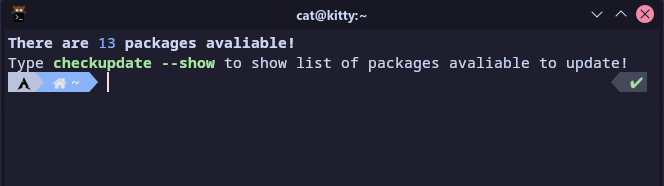
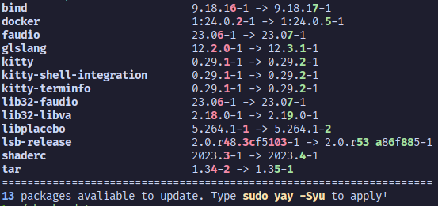

# Arch checkupdate

A program that prints avaliable packages. It uses safe checkupdates command, as well as check for AUR update. Can be used inside `.bashrc`, `.zshrc` or other shell rc file to remind that there are packages avaliable to update!

Requires to have `pacman-contrib` installed.

Optionally, `aurutils`<sub><sup>AUR</sup></sub> if you pass with `--withAUR` option

# Basic usage

Clone this project and simply run `./checkupdate`. It can be installed inside `~/.local/bin` directory or at root level (`/usr/bin`).

# Installation
Copy or symlink `checkupdate` file to `~/.local/bin`. Don't forget to add local bin directory to PATH env.
Example command: `ln -s $(pwd)/checkupdate ~/.local/bin/checkupdate`

# Examples

```checkupdate --help```
```
usage: checkupdate [-h] [--withAUR] [--show]

Small program that prints packages avaliable

options:
  -h, --help  show this help message and exit
  --withAUR   Enable AUR (requires to have aurutils installed)
  --show      Show list of packages avaliable
```

```checkupdate --show```<br>

# Upgrade
`git pull` and overwrite `checkupdate` if you only copied that file